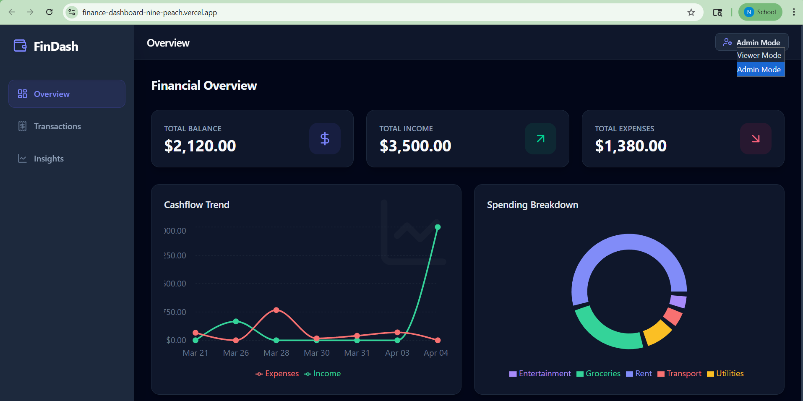
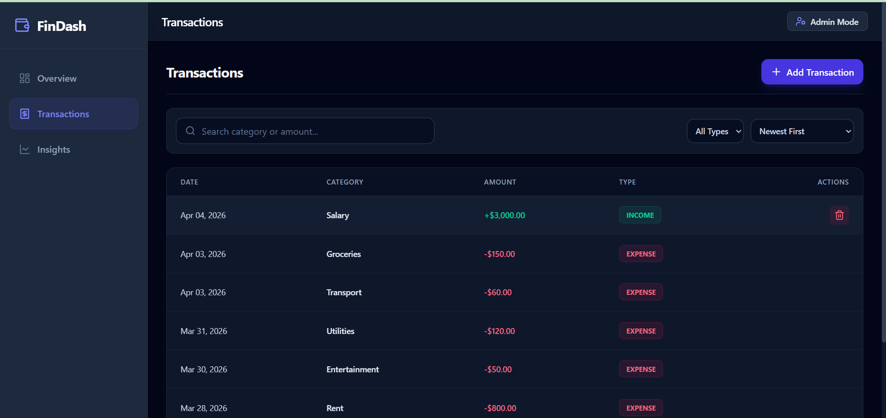
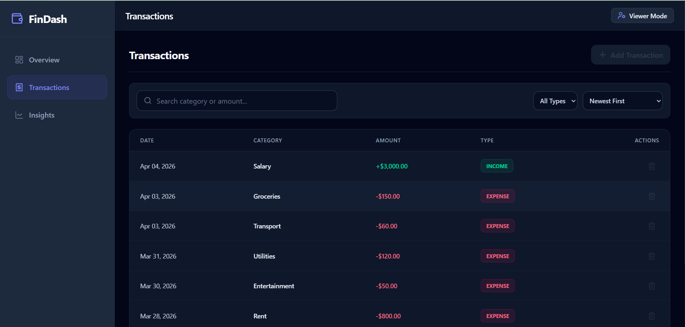
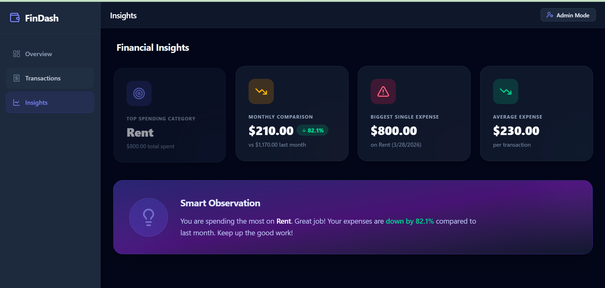

# Finance Dashboard

A modern and responsive Finance Dashboard built using React (Vite) that helps users track transactions, analyze insights, and manage financial data efficiently.

---

##  Live Demo
https://finance-dashboard-nine-peach.vercel.app/

---

##  Features

-  Interactive Dashboard with key financial metrics
-  Transaction Management (view, filter, categorize)
-  Insights Page for data visualization and trends
-  Role-Based Access Control (RBAC)
-  Fully Responsive Design (mobile + desktop)
-  Fast performance using Vite

---

##  Tech Stack

- **Frontend**: React.js (Vite)
- **Styling**: CSS / Tailwind (whichever you used)
- **State Management**: Context API
- **Routing**: React Router
- **Version Control**: Git & GitHub
- **Deployment**: Vercel

---

##  Architecture & Approach

The application is structured with a focus on modularity and scalability:

- **Components-based architecture** for reusability
- **Context API** used for global state management
- **Separate pages** for Dashboard, Transactions, and Insights
- Utility functions placed inside `/utils` for cleaner logic separation

---

##  Role-Based Access Control (RBAC)

- Different user roles can have different access levels
- Certain pages/components are conditionally rendered based on role
- Improves security and user experience

---
##  Screenshots

### Overview (Dashboard)

### Admin - Transactions View

### Viewer - Transactions View

### Insights

